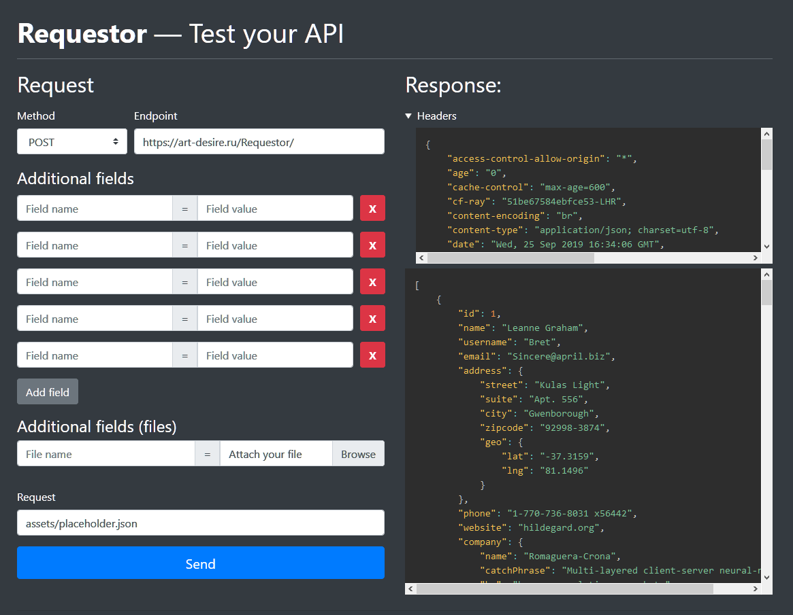

#  Requestor
[Requestor](https://artemijdeleto.github.io/Requestor) — simple web client for testing your API by making requests to it

## Features
* Change request method
* Add request params
* View response headers

## Dependencies
* [Vue.js](https://github.com/vuejs/vue)
* [Bootstrap](https://github.com/twbs/bootstrap)
* [Prism.js](https://github.com/PrismJS/prism) syntax highligher